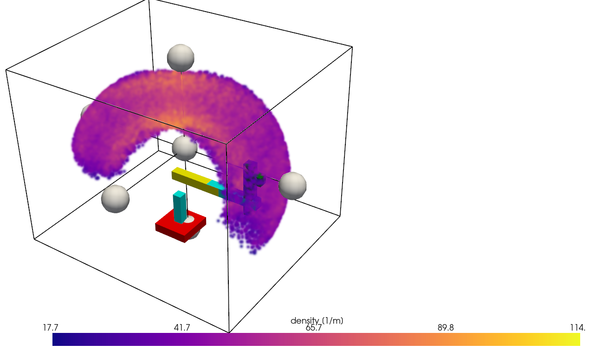

# visualisa

Simple visualiser for URDFs reach via point clouds. It's WIP, but usable even at this point.



## Getting Started

To get this running on your machine:

1.  **Install dependencies:**
    1.  if you have `uv` on your machine (recommended)
        ```bash
        uv sync
        ```
    2. if not:
        ```
        pip install .
        ```

2.  **Run the application:**
    1.  if you have `uv` on your machine (recommended)
    ```bash
    uv run app/main.py
    ```
    2. if not:
        ```
        python app/main.py
        ```

## Roadmap

For roadmap, please view issues